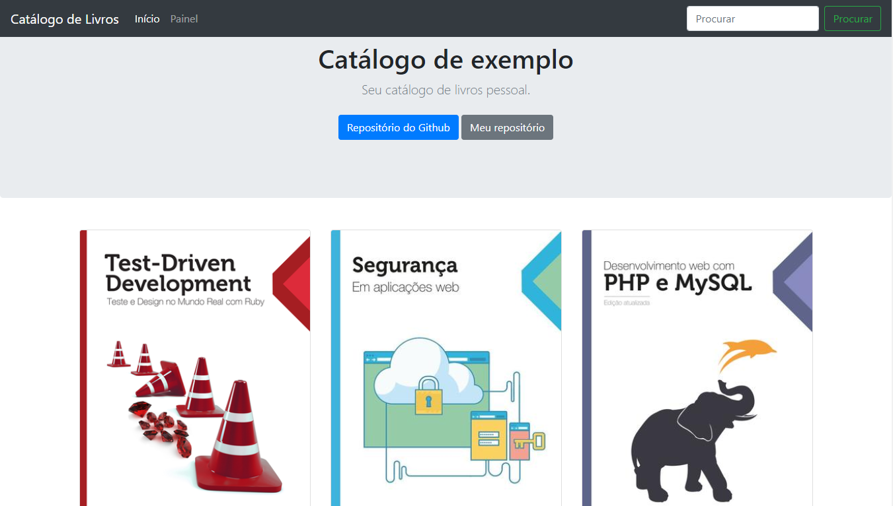
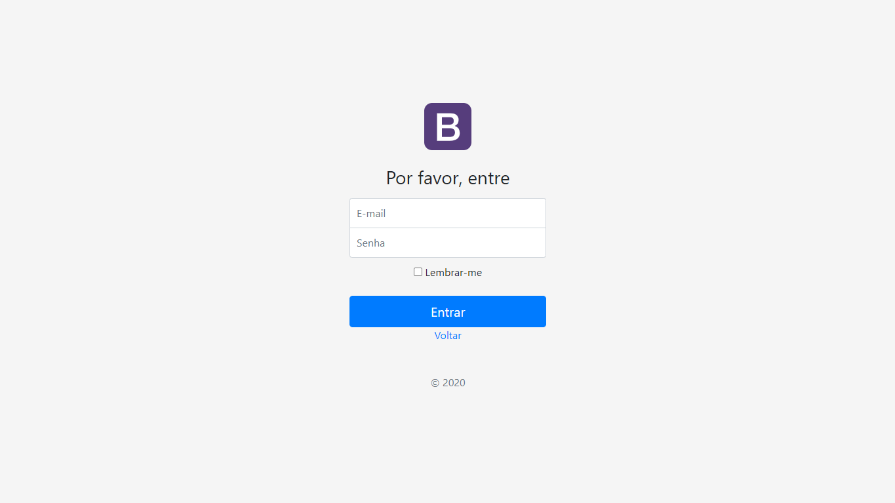
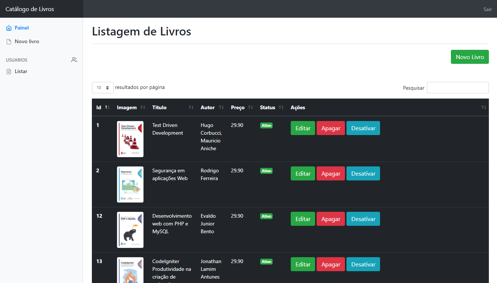
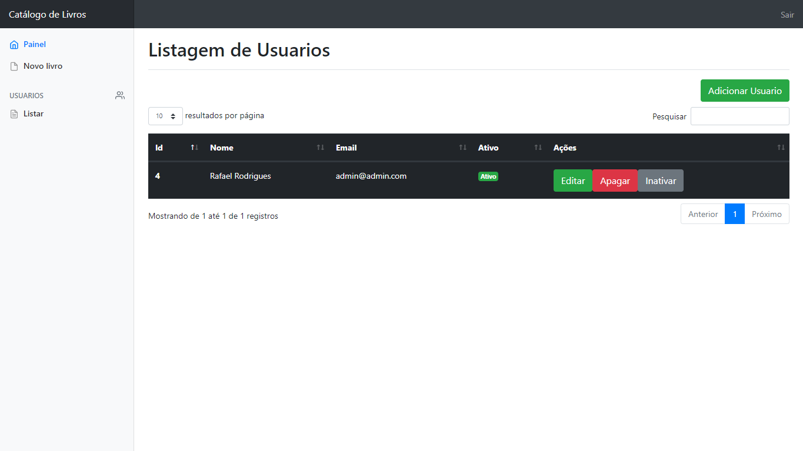

<h4 align="center">
    <h1 align="center">
		Catálogo de Livros
    </h1>
    <br><br>
    <p align="center">
      <a href="#-about">About</a>&nbsp;&nbsp;&nbsp;|&nbsp;&nbsp;&nbsp;
      <a href="#-technologies">Technologies</a>&nbsp;&nbsp;&nbsp;|&nbsp;&nbsp;&nbsp;
      <a href="#-how-to-run-the-project">Run</a>&nbsp;&nbsp;&nbsp;|&nbsp;&nbsp;&nbsp;
      <a href="#-info">Info</a>&nbsp;&nbsp;&nbsp;|&nbsp;&nbsp;&nbsp;
      <a href="#-pre-requirements">Pre requirements</a>&nbsp;&nbsp;&nbsp;|&nbsp;&nbsp;&nbsp;
      <a href="#-license">License</a>
  </p>
</h4>

<h1 align="center">
  
  <div style="display: flex; flex-direction: row;">
    
    
  <div>
  <div style="display: flex; flex-direction: row;">
    
    
  <div>
</h1>

## 🔖 About
Simples catálogo de organização de livros. Codado em PHP usando o framework CodeIgniter.

## 🚀 Technologies
- [PHP](https://www.php.net/)
- [Codeigniter](https://codeigniter.com/)
- [MariaBD](https://mariadb.org/)

## 🏁 How to run the project
#### Clone the repository
```bash
git clone https://github.com/rafinhaa/catalogo-livros.git
cd catalogo-livros
```

#### Database config
Em /database_dump/database.sql está uma cópia do banco de dados

Configurar em /aplication/config/config.php na linha 27 a base do projeto

## ℹ️ Info
#### Credentials
- Usuário: admin@admin.com
- Senha:   admin


## ✔️ Pre requirements
- Servidor PHP
- Servidor Mysql/MariaBD

## 📝 License
[MIT](docs/LICENSE.txt)

**Free Software, Hell Yeah!**
